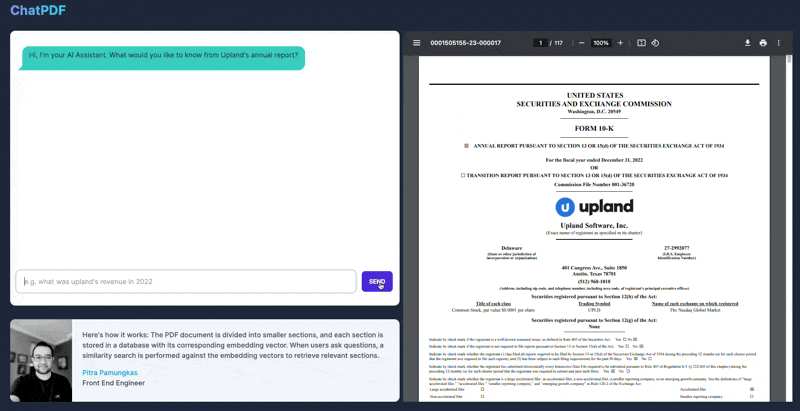
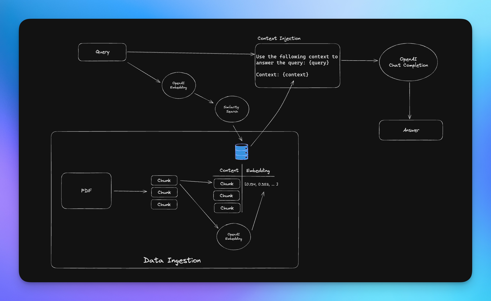
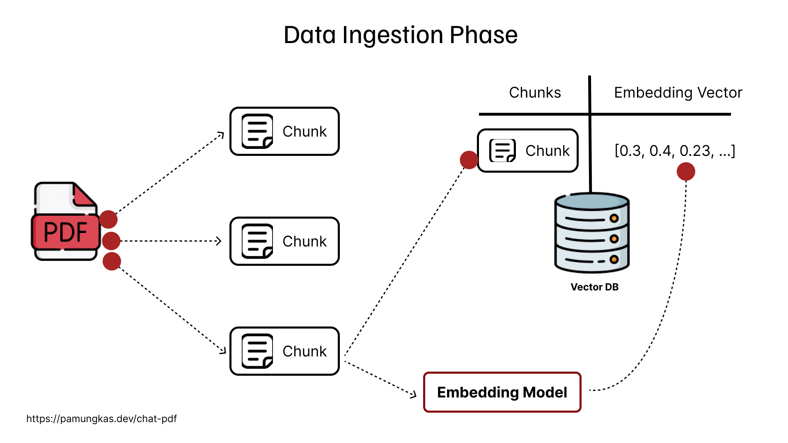
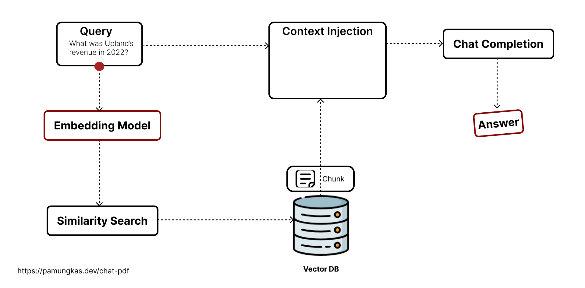

## Chat with Annual Report



This is Proof of Concept project where I divide an annual report PDF into smaller sections, and each section is stored in a database with its corresponding embedding vector. When users ask questions, a similarity search is performed against the embedding vectors to retrieve relevant sections.

```bash
$ npm i 

$ npm run dev
```

## Tech Stack

- NextJS
- Supabase with `pgvector` extension
- TailwindCSS
- Langchain


## Workflow


### Data Ingestion

- **PDF Chunking**: Split the PDF document into smaller chunks or sections to process them individually. This is particularly useful when dealing with large documents that might be computationally expensive to handle as a whole.

- **Preprocessing**: Apply standard preprocessing techniques to the extracted text, including tokenization, lowercase conversion, removal of punctuation, stop words, and special characters. 

- **Embedding Generation**: Utilize the OpenAI Embedding Model to generate embeddings for each preprocessed chunks. These embeddings capture semantic information and encode it in fixed-length vector.

- **Vector DB Storage**: Store the generated document embeddings in a vector database (in this case, I'm using Supabase with `pgvector` extension instead of "real" vector DB) for efficient retrieval and similarity searches. The vector database enables fast indexing and searching based on the similarity of document embeddings. 



### Query Processing

- The query is fed into the OpenAI Embedding model to generate an embedding.
- The embedding of the query is used to perform a similarity search in the vector database.
- The relevant chunk from the database is then used as context and sent to the OpenAI chat completion API to obtain the final answer.

